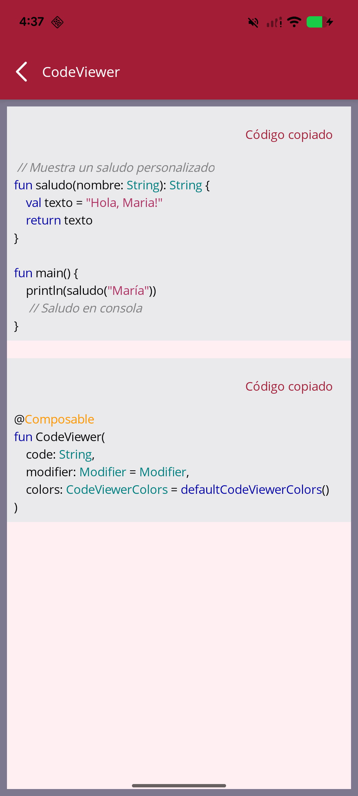
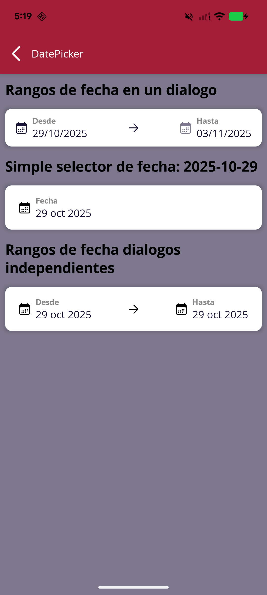

# 🧩 🎨 Catálogo de Componentes

A continuación se muestran los componentes disponibles.  

| Componente | Imagen | Descripción |
|-------------|---------|-------------|
| [**AccountDetails**](components/AccountDetails.md) |  | n/a |
| [**AccountDetailsItem**](components/AccountDetailsItem.md) |  | n/a |
| [**AlertBox**](components/AlertBox.md) |  | n/a |
| [**AmountTextField**](components/AmountTextField.md) |  | n/a |
| [**ArrowIndicator**](components/ArrowIndicator.md) |  | n/a |
| [**AsyncImageComponent**](components/AsyncImageComponent.md) |  | n/a |
| [**Avatar**](components/Avatar.md) |  | n/a |
| [**BadgedContainer**](components/BadgedContainer.md) |  | n/a |
| [**BadgedIcon**](components/BadgedIcon.md) |  | n/a |
| [**BankStatementCalendar**](components/BankStatementCalendar.md) |  | n/a |
| [**BannerBenefitsSkeleton**](components/BannerBenefitsSkeleton.md) |  | n/a |
| [**BannersBenefits**](components/BannersBenefits.md) |  | n/a |
| [**BitmapCaptureBox**](components/BitmapCaptureBox.md) |  | n/a |
| [**BulletPoint**](components/BulletPoint.md) |  | n/a |
| [**ButtonIcon**](components/ButtonIcon.md) |  | n/a |
| [**CardCarousel**](components/CardCarousel.md) |  | n/a |
| [**CardCarouselBack**](components/CardCarouselBack.md) |  | n/a |
| [**CardCarouselFront**](components/CardCarouselFront.md) |  | n/a |
| [**CardComponent**](components/CardComponent.md) |  | n/a |
| [**CardContainerSkeleton**](components/CardContainerSkeleton.md) |  | n/a |
| [**CardDateRangePicker**](components/CardDateRangePicker.md) |  | n/a |
| [**CardDetailRewards**](components/CardDetailRewards.md) |  | n/a |
| [**CardFlip**](components/CardFlip.md) |  | n/a |
| [**CardGuaranteed**](components/CardGuaranteed.md) |  | n/a |
| [**CardImageBackground**](components/CardImageBackground.md) |  | n/a |
| [**CardMovementDetail**](components/CardMovementDetail.md) |  | n/a |
| [**CardPaymentOption**](components/CardPaymentOption.md) |  | n/a |
| [**CardRetry**](components/CardRetry.md) |  | n/a |
| [**CardsCarousel**](components/CardsCarousel.md) |  | n/a |
| [**CardScroll**](components/CardScroll.md) |  | n/a |
| [**CardStatusToogle**](components/CardStatusToogle.md) |  | n/a |
| [**CardWithRows**](components/CardWithRows.md) |  | n/a |
| [**CheckboxParent**](components/CheckboxParent.md) |  | n/a |
| [**ChipCard**](components/ChipCard.md) |  | n/a |
| [**CircularProgressIndicator**](components/CircularProgressIndicator.md) |  | n/a |
| [**CircularSeekBar**](components/CircularSeekBar.md) |  | n/a |
| [**ClaireCard**](components/ClaireCard.md) |  | n/a |
| [**CodeViewer**](components/CodeViewer.md) |  | n/a |
| [**ContactRowCard**](components/ContactRowCard.md) |  | n/a |
| [**ContainerCard**](components/ContainerCard.md) |  | n/a |
| [**ContainerCorner**](components/ContainerCorner.md) |  | n/a |
| [**ContainerCornerBottom**](components/ContainerCornerBottom.md) |  | n/a |
| [**ContainerCornerTop**](components/ContainerCornerTop.md) |  | n/a |
| [**ContainerGradient**](components/ContainerGradient.md) |  | n/a |
| [**ContainerSkeleton**](components/ContainerSkeleton.md) |  | n/a |
| [**ContainerToast**](components/ContainerToast.md) |  | n/a |
| [**CopyableNumberField**](components/CopyableNumberField.md) |  | n/a |
| [**CreditCard**](components/CreditCard.md) |  | n/a |
| [**CreditCardInfoItem**](components/CreditCardInfoItem.md) |  | n/a |
| [**CreditCardWithRows**](components/CreditCardWithRows.md) |  | n/a |
| [**CreditHtmlText**](components/CreditHtmlText.md) |  | n/a |
| [**CreditLimitSlider**](components/CreditLimitSlider.md) |  | n/a |
| [**CustomBottomSheets**](components/CustomBottomSheets.md) |  | n/a |
| [**CustomCheckBox**](components/CustomCheckBox.md) |  | n/a |
| [**CustomDropdownTextField**](components/CustomDropdownTextField.md) |  | n/a |
| [**CustomEraseTextField**](components/CustomEraseTextField.md) |  | n/a |
| [**CustomLinearProgress**](components/CustomLinearProgress.md) |  | n/a |
| [**CustomRadioButton**](components/CustomRadioButton.md) |  | n/a |
| [**CustomSwitch**](components/CustomSwitch.md) |  | n/a |
| [**CustomTabComponent**](components/CustomTabComponent.md) |  | n/a |
| [**CustomVerticalScrollBar**](components/CustomVerticalScrollBar.md) |  | n/a |
| [**DatePicker**](components/DatePicker.md) |  | n/a |
| [**DateRangePicker**](components/DateRangePicker.md) |  | n/a |
| [**DebitCard**](components/DebitCard.md) |  | n/a |
| [**DebitCardComponent**](components/DebitCardComponent.md) |  | n/a |
| [**DebugHttpViewer**](components/DebugHttpViewer.md) |  | n/a |
| [**DeferCardComponent**](components/DeferCardComponent.md) |  | n/a |
| [**DropdownPaymentMethod**](components/DropdownPaymentMethod.md) |  | n/a |
| [**ErrorDialog**](components/ErrorDialog.md) |  | n/a |
| [**ErrorDialogTemplate**](components/ErrorDialogTemplate.md) |  | n/a |
| [**ExpandableCard**](components/ExpandableCard.md) |  | n/a |
| [**ExpandableCreditCard**](components/ExpandableCreditCard.md) |  | n/a |
| [**ExpandableMenuButton**](components/ExpandableMenuButton.md) |  | n/a |
| [**FaqContainer**](components/FaqContainer.md) |  | n/a |
| [**FilterChip**](components/FilterChip.md) |  | n/a |
| [**FlippableCarouselCard**](components/FlippableCarouselCard.md) |  | n/a |
| [**FloatingDialog**](components/FloatingDialog.md) |  | n/a |
| [**FooterMenuInfo**](components/FooterMenuInfo.md) |  | n/a |
| [**GenericConfigurationScreen**](components/GenericConfigurationScreen.md) |  | n/a |
| [**GradientCircleWithIcon**](components/GradientCircleWithIcon.md) |  | n/a |
| [**GradientIconStyle**](components/GradientIconStyle.md) |  | n/a |
| [**GradientShieldWithIcon**](components/GradientShieldWithIcon.md) |  | n/a |
| [**HamburgerMenu**](components/HamburgerMenu.md) |  | n/a |
| [**HighlightCode**](components/HighlightCode.md) |  | n/a |
| [**HtmlText**](components/HtmlText.md) |  | n/a |
| [**IconSegmented**](components/IconSegmented.md) |  | n/a |
| [**InfoBox**](components/InfoBox.md) |  | n/a |
| [**ItemDebugView**](components/ItemDebugView.md) |  | n/a |
| [**ItemNotification**](components/ItemNotification.md) |  | n/a |
| [**ItemRowCard**](components/ItemRowCard.md) |  | n/a |
| [**ItemSelectorRow**](components/ItemSelectorRow.md) |  | n/a |
| [**LinearSeekBar**](components/LinearSeekBar.md) |  | n/a |
| [**LinkText**](components/LinkText.md) |  | n/a |
| [**ListCardItemsMovements**](components/ListCardItemsMovements.md) |  | n/a |
| [**ListCreditCardInfo**](components/ListCreditCardInfo.md) |  | n/a |
| [**LogoComponent**](components/LogoComponent.md) |  | n/a |
| [**LogoutButton**](components/LogoutButton.md) |  | n/a |
| [**LottieLoader**](components/LottieLoader.md) |  | n/a |
| [**LottieLoaderController**](components/LottieLoaderController.md) |  | n/a |
| [**LottiePreloader**](components/LottiePreloader.md) |  | n/a |
| [**LoyaltyProgramCard**](components/LoyaltyProgramCard.md) |  | n/a |
| [**MagicCustomBottomSheet**](components/MagicCustomBottomSheet.md) |  | n/a |
| [**MagicTextField**](components/MagicTextField.md) |  | n/a |
| [**MarkdownDSLBuilder**](components/MarkdownDSLBuilder.md) |  | n/a |
| [**MarkdownView**](components/MarkdownView.md) |  | n/a |
| [**MenuButton**](components/MenuButton.md) |  | n/a |
| [**MenuList**](components/MenuList.md) |  | n/a |
| [**MiniAccountState**](components/MiniAccountState.md) |  | n/a |
| [**MiniBannersBenefits**](components/MiniBannersBenefits.md) |  | n/a |
| [**MiniCard**](components/MiniCard.md) |  | n/a |
| [**MovementsCard**](components/MovementsCard.md) |  | n/a |
| [**MovementsCardSkeleton**](components/MovementsCardSkeleton.md) |  | n/a |
| [**MyAdditionalCard**](components/MyAdditionalCard.md) |  | n/a |
| [**MyAdditionalMiniCard**](components/MyAdditionalMiniCard.md) |  | n/a |
| [**NavigationDrawer**](components/NavigationDrawer.md) |  | n/a |
| [**OfferCard**](components/OfferCard.md) |  | n/a |
| [**OffersCarousel**](components/OffersCarousel.md) |  | n/a |
| [**OneLineRowCard**](components/OneLineRowCard.md) |  | n/a |
| [**OtpComponent**](components/OtpComponent.md) |  | n/a |
| [**OtpScreen**](components/OtpScreen.md) |  | n/a |
| [**OtpTextField**](components/OtpTextField.md) |  | n/a |
| [**PasswordValidator**](components/PasswordValidator.md) |  | n/a |
| [**PaymentSummaryCard**](components/PaymentSummaryCard.md) |  | n/a |
| [**PdfViewer**](components/PdfViewer.md) |  | n/a |
| [**PlaceholderValueItem**](components/PlaceholderValueItem.md) |  | n/a |
| [**PrimaryButton**](components/PrimaryButton.md) |  | n/a |
| [**PrimaryOutlinedButton**](components/PrimaryOutlinedButton.md) |  | n/a |
| [**ProgramProgressCard**](components/ProgramProgressCard.md) |  | n/a |
| [**PullRefreshDemo**](components/PullRefreshDemo.md) |  | n/a |
| [**RadioButtonParent**](components/RadioButtonParent.md) |  | n/a |
| [**ResponsiveText**](components/ResponsiveText.md) |  | n/a |
| [**SearchBarComponent**](components/SearchBarComponent.md) |  | n/a |
| [**SecondaryButton**](components/SecondaryButton.md) |  | n/a |
| [**SectionHeader**](components/SectionHeader.md) |  | n/a |
| [**SectionItem**](components/SectionItem.md) |  | n/a |
| [**SectionMovementsCard**](components/SectionMovementsCard.md) |  | n/a |
| [**SegmentedControlCustom**](components/SegmentedControlCustom.md) |  | n/a |
| [**SignaturePad**](components/SignaturePad.md) |  | n/a |
| [**SimpleAppBar**](components/SimpleAppBar.md) |  | n/a |
| [**SimpleButton**](components/SimpleButton.md) |  | n/a |
| [**SimpleLabel**](components/SimpleLabel.md) |  | n/a |
| [**SkeletonCalendar**](components/SkeletonCalendar.md) |  | n/a |
| [**SkeletonCarouselProductDetail**](components/SkeletonCarouselProductDetail.md) |  | n/a |
| [**SkeletonCreditCard**](components/SkeletonCreditCard.md) |  | n/a |
| [**SkeletonDebitCard**](components/SkeletonDebitCard.md) |  | n/a |
| [**SkeletonFaqList**](components/SkeletonFaqList.md) |  | n/a |
| [**SkeletonHomeOfferCard**](components/SkeletonHomeOfferCard.md) |  | n/a |
| [**SkeletonLine**](components/SkeletonLine.md) |  | n/a |
| [**SkeletonLoadingError**](components/SkeletonLoadingError.md) |  | n/a |
| [**SkeletonMovements**](components/SkeletonMovements.md) |  | n/a |
| [**SkeletonMovementsState**](components/SkeletonMovementsState.md) |  | n/a |
| [**SkeletonOffer**](components/SkeletonOffer.md) |  | n/a |
| [**SkeletonOffersForYou**](components/SkeletonOffersForYou.md) |  | n/a |
| [**SkeletonProductDetail**](components/SkeletonProductDetail.md) |  | n/a |
| [**SkeletonProductDetailsTDD**](components/SkeletonProductDetailsTDD.md) |  | n/a |
| [**SkeletonProductInformation**](components/SkeletonProductInformation.md) |  | n/a |
| [**SkeletonPromotion**](components/SkeletonPromotion.md) |  | n/a |
| [**SkeletonShape**](components/SkeletonShape.md) |  | n/a |
| [**SliderRangeControl**](components/SliderRangeControl.md) |  | n/a |
| [**SplashComponents**](components/SplashComponents.md) |  | n/a |
| [**SquareButton**](components/SquareButton.md) |  | n/a |
| [**StateSkeleton**](components/StateSkeleton.md) |  | n/a |
| [**Stepper**](components/Stepper.md) |  | n/a |
| [**StyledText**](components/StyledText.md) |  | n/a |
| [**SwipeDeleteBackground**](components/SwipeDeleteBackground.md) |  | n/a |
| [**SwipeToDeleteContainer**](components/SwipeToDeleteContainer.md) |  | n/a |
| [**TextArea**](components/TextArea.md) |  | n/a |
| [**TextBlock**](components/TextBlock.md) |  | n/a |
| [**TextField**](components/TextField.md) |  | n/a |
| [**TextFieldPassword**](components/TextFieldPassword.md) |  | n/a |
| [**TextIcon**](components/TextIcon.md) |  | n/a |
| [**TitleWithEyeButton**](components/TitleWithEyeButton.md) |  | n/a |
| [**ToggleEyeVisibilityIcon**](components/ToggleEyeVisibilityIcon.md) |  | n/a |
| [**TopAppBarPrimary**](components/TopAppBarPrimary.md) |  | n/a |
| [**TopAppBarSecondary**](components/TopAppBarSecondary.md) |  | n/a |
| [**TransferDestinationItem**](components/TransferDestinationItem.md) |  | n/a |
| [**UISpacer**](components/UISpacer.md) |  | n/a |
| [**Voucher**](components/Voucher.md) |  | n/a |
| [**VoucherHorizontalTitleDescription**](components/VoucherHorizontalTitleDescription.md) |  | n/a |
| [**WebViewPageComponent**](components/WebViewPageComponent.md) |  | n/a |
