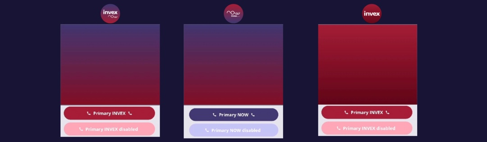

<center>
| Segmentación de usuario| 
| :----------------: |
|  | 
</center>

Componente de segmentación de temas para Android Compose

## Descripción breve
`ThemeSegmented` es un componente del artefacto que permite gestionar y aplicar esquemas de color personalizados según la marca y variante de tema en aplicaciones desarrolladas con Jetpack Compose. Facilita la personalización visual y la segmentación de la experiencia de usuario según el cliente o segmento de negocio.

## Características principales
- Soporte para múltiples marcas (ONE, NOW, INVEX)
- Variantes de tema: NORMAL, LIGHT, DARK
- Integración sencilla con MaterialTheme de Compose
- Configuración flexible mediante enums y data classes
- Conversión fácil entre enteros y configuraciones de tema

## Guía de uso

### Agregar dependencia
Incluye el módulo `uikit` en tu archivo `build.gradle`:

```kotlin frame="terminal"
// build.gradle (módulo)
dependencies {
    implementation(project(":uikit"))
}
```

### 2. Aplicar el tema en tu Composable principal

```kotlin frame="terminal"
import com.invex.one.uikit.theme.segmentation.*

@Composable
fun MyApp() {
    InvexOneTheme(
        themeConfig = ThemeConfig(
            client = ClientBrand.NOW,
            variant = ThemeVariant.DARK
        )
    ) {
        // Tu contenido Compose aquí
    }
}
```

### 3. Obtener un esquema de color desde el ClientBrand

```kotlin frame="terminal"
val colorScheme = getColorSchemeFromInt(CLIENT_BRAND)
```

### Controla la segmentación en tus preview


```kotlin frame="terminal"
@Composable
@OneComponentPreview
fun MyAdditionalCardPreview() {
    val brand = ClientBrand.{ONE, NOW, INVEX} 
    CURRENT_CLIENT_BRAND = { clientBrandToInt(brand) }
    MyAdditionalCard(..)
}
```

## Configuración y personalización

Cambia la marca (`ClientBrand`) y variante (`ThemeVariant`) según las necesidades de tu aplicación.
Puedes extender los esquemas de color agregando nuevas marcas o variantes en los enums y proporcionando nuevos esquemas de color.

